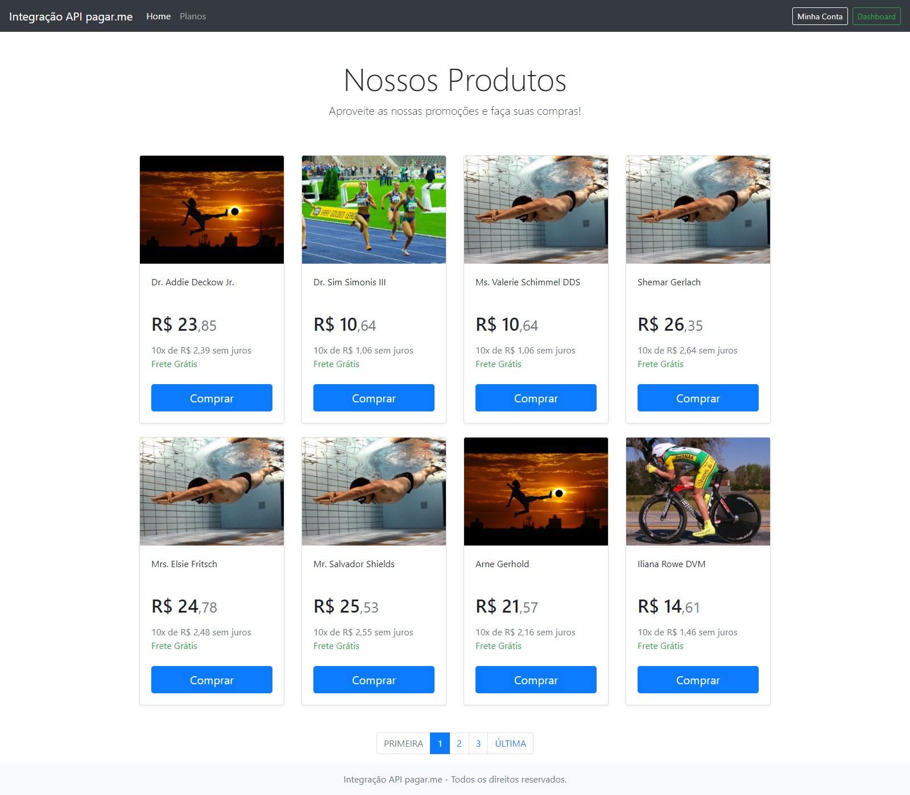

# Integração API pagar.me


## Sobre <a name = "about"></a>

Projeto em PHP com framework Laravel, que permite integração com a API da  pagar.me



## Inicio <a name = "getting_started"></a>

Projeto desenvolvido em PHP v7.3, Laravel v8.0

### Pré-requisito

PHP v7.3, Laravel v8.0

### Instalação

- Clone o repositório com __git clone__ executando o comando:
```
git clone https://github.com/gilcleis/integracao_pagueme.git
```
- Acesse o diretorio criado
- Crie uma copia do arqruivo __.env.example__ nomeando para __.env__ 

- configure as credencias de banco de dados no arquivo __.env__

```
DB_CONNECTION=mysql
DB_HOST=127.0.0.1
DB_PORT=3306
DB_DATABASE=pagarme
DB_USERNAME=root
DB_PASSWORD=
```
- Criar a __chave__ para acesso consultando a documetalção do pagarme em https://docs.pagar.me
- adicionar a chave __URI_BASE_PAGARME="https://api.pagar.me/1/"__ no __.env__ 
- adicionar a chave __API_KEY_PAGARME= "coloque_aqui_a_chave_da_api"__ no __.env__ 

- Execute o comando:

```
composer install
```
- Execute o comando:

```
php artisan key:generate
```
- Execute o comando:

```
php artisan migrate --seed
```


- Inicie o URL principal ou execute o camando:
```
php artisan serve
```

- Login (URL principal ou localhost:8080/admin):
```
email = admin@admin.com
senha =  123456add 
```
